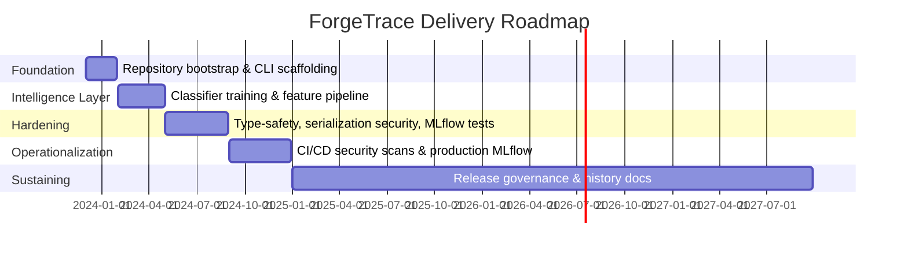

# Project Timeline

## High-Level Phases

## Detailed Milestones

| Date | Milestone | Details |
|------|-----------|---------|
| 2023-12 | **Initial scaffold** | Created `forgetrace` package, CLI entrypoint, and baseline README/architecture docs. |
| 2024-01 | **Scanner integrations** | Added Git, SBOM, license, similarity, and secret scanners under `forgetrace/scanners`. Each shipped with pytest coverage and fixture data. |
| 2024-03 | **Training pipeline** | Established `training/` datasets, profiling cache, and initial RandomForest classifier persisted via `joblib`. Introduced `scripts/train_random_forest.py` and MLflow metadata capture. |
| 2024-05 | **Type safety push** | Ran `mypy` across the tree, added missing stubs, tightened dataclass annotations, and resolved subtle `Optional` bugs highlighted by the type checker. |
| 2024-06 | **Security hardening** | Replaced unsafe `pickle` usage with `joblib`, enabled Jinja2 autoescaping, swapped MD5 shingles for `hashlib.blake2b`, and wrapped urllib calls with `_safe_urlopen`. Bandit went from 4 high severity findings to zero. |
| 2024-08 | **MLflow dependency pinning** | Documented CVE backlog, locked MLflow at 3.6.0, and added mitigations (private network, nginx auth, artifact provenance checks). |
| 2024-09 | **End-to-end MLflow tests** | Added SQLite-backed fixture plus quick, comparison, feature, and CI/CD reproduction tests under `tests/mlflow/`. These broke the dependency on an external tracking server. |
| 2024-10 | **Security documentation refresh** | Expanded `SECURITY.md`, `PRODUCTION_READY.md`, and runbooks describing password rotation, backup cadences, and incident response drills. |
| 2024-11 | **Release governance** | Introduced `config/mlflow_release.yaml`, `scripts/update_mlflow_release.py`, and the MLflow Upgrade Playbook to unblock the Safety advisories as soon as an upstream fix lands. |
| 2025-11 | **Journey archive** | Staged the `docs/history/` directory (this file!) to capture lessons learned, troubleshooting notes, and onboarding guides. |

## Lessons Learned Per Phase

1. **Foundation:** Keeping the CLI thin while leaning on modular scanners made it easy to add new detectors without rewiring the interface.
2. **Intelligence Layer:** Persisting models via `joblib` first prevented the later security scramble when `pickle` was banned.
3. **Hardening:** Running `mypy`, `bandit`, and `safety` together revealed cross-cutting issues (e.g., type assumptions hiding unsafe serialization).
4. **Operationalization:** Local MLflow fixtures plus dockerized production parity avoided the "works on laptop" trap.
5. **Sustaining:** Investing in release metadata (`config/mlflow_release.yaml`) and historical docs prevents knowledge from living solely in Slack threads.

Update this timeline whenever a meaningful architectural or operational event takes place.
