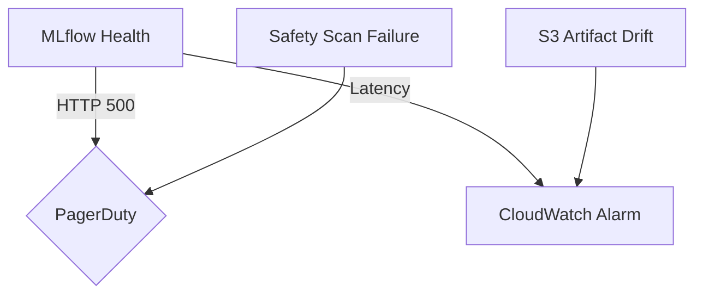

# Maintenance & Expansion Playbook

## 1. Recurring Maintenance

| Area | Action | Owner | Notes |
|------|--------|-------|-------|
| Dependencies | Run `safety`, `pip-audit`, and `bandit` weekly. | Platform | Attach reports to `analysis_outputs/live/`. |
| MLflow | Track CVE status via `config/mlflow_release.yaml`. | ML Lead | Follow Upgrade Playbook ASAP after fixes land. |
| Models | Retrain RandomForest with new profiling samples. | ML Lead | Store resulting artifacts under `models/` with semantic version tags. |
| Documentation | Refresh `docs/history/` after each release. | All | Treat as living journal. |

## 2. Expansion Scenarios

### Scenario A: New Scanner Module

1. Draft spec inside `docs/updates/` describing detection heuristics.
2. Scaffold scanner under `forgetrace/scanners/<name>.py` with pure functions.
3. Add fixtures + tests in `tests/<name>_scanner.py`.
4. Wire CLI flag + config entry; document in `USAGE.md`.
5. Run `pytest -k <name>`, `bandit`, and `safety` before PR.

### Scenario B: Production MLflow on Kubernetes

- Leverage existing Docker image; create Helm chart referencing `container_image` from `config/mlflow_release.yaml`.
- Add liveness/readiness probes mirroring `/health` endpoint.
- Store backend store URI in Kubernetes Secret; mount S3 credentials via IAM Roles for Service Accounts.
- Update `docs/MLFLOW_UPGRADE_PLAYBOOK.md` with kube-specific rollout steps.

### Scenario C: Multi-model Inference

- Extend classifier registry to load multiple joblib files with signatures stored in MLflow tags.
- Add gating logic in `forgetrace/classifiers/ml_classifier.py` to fan out predictions.
- Log comparison metrics using `tests/mlflow/test_mlflow_model_comparison.py` as template.

## 3. Learning Scope & Knowledge Sharing

- Pairing sessions: schedule monthly walkthroughs covering scanners, ML pipeline, and infra.
- Lunch & Learn topics backlog lives in `docs/history/README.md`; add suggestions with owners.
- Encourage contributors to add diagrams/mermaid blocks when documenting new flows.

## 4. Monitoring & Alerting Wishlist



- Hook `/health` endpoint to uptime monitors.
- Emit CloudWatch metrics for request latency + artifact push counts.
- Forward Safety failures from CI to Slack channel `#forgetrace-alerts`.

## 5. Implementation Guide Snippets

- **Safety pipeline:**

  ```bash
  safety check --full-report | tee analysis_outputs/live/safety-$(date +%F).txt
  ```

- **Experiment export:**

  ```bash
  mlflow experiments list
  mlflow artifacts download --run-id <id> --dst mlruns/exports/<id>
  ```

- **Terraform drift detection:**

  ```bash
  cd terraform
  terraform plan -out plan.tfplan
  ```

## 6. Maintenance Dashboard (Textual)

| Metric | Target | Source |
|--------|--------|--------|
| Safety CVEs | 0 critical/high | `safety check` output. |
| MLflow uptime | 99.5% monthly | Uptime robot / CloudWatch. |
| Model refresh cadence | <= 90 days | `models/` version log. |
| Documentation freshness | <= 30 days since last edit | Git history for `docs/history/`. |

Revisit this playbook quarterly to ensure our maintenance posture evolves alongside the product.

